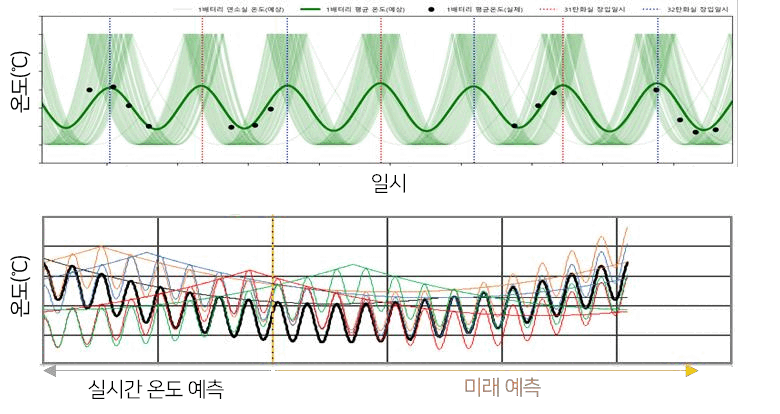
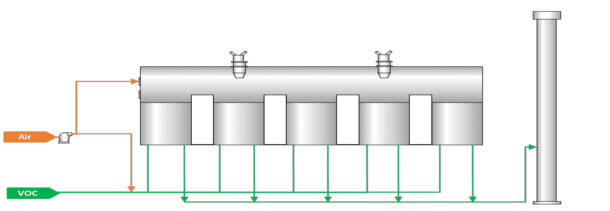
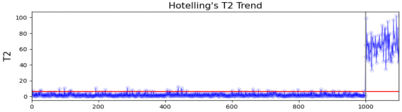
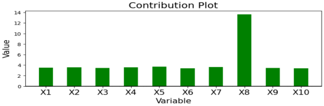

# 경력 및 프로젝트

화학공학을 전공하고 2020년부터 제조 공정 데이터를 다뤄왔습니다. 가상센서와 실시간 모니터링에서 시작해 이상 징후 탐지, 운전 가이드, 생산계획 최적화로 업무 범위를 넓혀왔습니다.

> 회사와 고객의 비공개 코드·데이터·시스템 구성은 포함하지 않았으며, 일부 공정 정보는 일반화했습니다.

## 금호석유화학 · AI Engineer

`2025.01–현재`

현업 부서와 과제의 목표와 적용 범위를 정하고, 공정·생산 데이터 분석부터 모델 개발, 서비스 적용과 운영 중 개선까지 담당합니다.

### 참여 과제

| 기간 | 과제 | 주요 역할 |
|---|---|---|
| 2025.12–2026.06 | 일별 생산계획안 생성 PoC 및 제약 구조 개선 | 2단계 CP-SAT 구현, OWL 지식모델·변환 계층 설계 |
| 2025.11–현재 | 보일러 SOx 약품 투입량 최적화 가이드 | 모델 개발, 기준값 설계, 서비스 운영·개선 |
| 2025.06–2025.12 | 건조설비 이상 징후 탐지 PoC | 현업 인터뷰, 탐지모델 개발, 서비스 검증 |

### 대표 과제

#### 일별 생산계획안 생성 PoC

`2025.12–2026.03` · 단일 라인, 4개 제품

**배경과 목표**

SAP 판매계획이 갱신될 때마다 담당자가 Excel에서 일별 생산계획을 수작업으로 재편성하는 구조임. 수요와 운전 조건을 만족하는 계획안을 생성해 담당자의 검토 시간을 줄이고자 함.

**수행 내용**

- CP-SAT를 활용해 생산계획을 두 단계로 구성
  1. 월 단위 생산품목과 가동일수 결정
  2. 일별 생산품목과 생산량 편성
- 수요와 생산능력은 반드시 지켜야 하는 제약으로, 품종 전환 손실은 목적함수 비용으로 반영
- 최종 결과는 담당자가 검토할 계획안 1건으로 출력

**검증 및 결과**

- 과거 90일을 대상으로 날짜별 생산제품과 생산량이 모두 일치하는지를 비교
- 90일 중 현업 계획과 일치한 날의 비율은 약 78%
- 불일치한 날짜는 모델에 반영되지 않은 운전 규칙을 찾는 자료로 활용

**후속 작업**

라인·제품·제약 규칙을 OWL로 분리하고, Python 변환 계층에서 CP-SAT 변수와 제약식으로 생성하는 프로토타입을 구현했습니다. 이미 정의된 규칙은 OWL에서 값과 적용 대상을 바꿀 수 있도록 구성했습니다. 다중 라인·다품종 확장은 사업 여건 변화로 보류됐습니다.

#### 보일러 SOx 약품 투입량 최적화 가이드

`2025.11–2026.05 개발 · 2026.06 정식 운영 시작`

**배경과 목표**

운전자와 교대조별 안전 여유가 달라 동일한 공정 조건에서도 약품 투입량 편차와 과투입이 발생함. SOx 배출기준을 준수하면서 약품 투입량을 줄일 수 있는 공통 기준을 만들고자 함.

**수행 내용**

- SOx 기준을 안정적으로 만족하면서 약품 투입이 적었던 과거 운전 구간을 선별
- 공정 상태를 구분하고, 상태별 SOx와 약품 투입량 분포에서 참고 기준값을 산출
- 현재 배출수준과 배출기준까지의 여유를 반영해 줄일 수 있는 투입량을 제시
- 운전 데이터에서 관측된 투입량과 SOx의 관계를 화면에 함께 표시

**운영 및 개선**

- 2026년 6월부터 정식 운영
- 가이드는 제어 시스템과 분리돼 있으며, 보드 운전원이 공정 상태를 확인해 최종 투입량을 결정
- 데이터가 부족한 일부 상태에서 기준값이 생성되지 않는 문제를 확인
- 이후 상태별 기준값에만 의존하지 않고, 정상 SOx 범위와 범위 이탈 정도에 따라 투입량을 보정하도록 로직을 변경
- 입력 분포가 달라지면 기준값과 모델을 재검토하고, 담당자 확인 후 운영에 반영

#### 건조설비 이상 징후 탐지 PoC

`2025.06–2025.12`

**배경과 목표**

건조설비의 이상이 설비 정지와 품질 문제로 이어질 수 있음. 이상 징후를 조기에 탐지해 운전원이 설비 상태를 확인하고 조치할 수 있도록 하고자 함.

**수행 내용**

- 운전자 인터뷰에서 이상 발생 전에 나타나는 온도 패턴을 확인해 탐지 규칙으로 정의
- UMAP과 Gaussian HMM을 이용한 다변량 상태 모델을 규칙과 결합
- 이상 신호가 발생하면 보드 운전원이 설비 상태를 확인해 정지 여부를 판단하는 절차로 구성

**검증 및 결과**

- 과거 고장 사례에서 이상 징후를 10~15분 앞서 포착
- 오탐이 많아 현장에서 지속적으로 사용하기 어렵다고 판단해 PoC로 마무리

## 테크다스 기술연구소 · 연구원

`2020.07–2024.12`

철강·석유화학 공정을 대상으로 가상센서, 이상진단 알고리즘과 실시간 모니터링 서비스를 개발했습니다. 예측모델뿐 아니라 데이터 수집·처리 구조, 웹서비스와 현장 적용 후 성능 개선을 함께 담당했습니다.

### 참여 과제

| 기간 | 과제 | 주요 역할 |
|---|---|---|
| 2024.03–2024.08 | 코크스 오븐 온도 예측 가상센서 확산 | 알고리즘 성능 개선, 시각화·웹서비스 |
| 2023.05–2024.03 | 대형압연 가열로 가상센서 개발 | 예측 알고리즘 개발 |
| 2023.08–2023.12 | 가열로 배기가스 CO 가상센서 개발 | 시각화·웹서비스 |
| 2023.05–2023.12 | 코크스 오븐 온도 예측 가상센서 개발 | 알고리즘 개발, 시스템 설계, 데이터 파이프라인, 웹서비스 |
| 2022.08–2022.12 | NCC 공정 센서 알람 고도화 | 알람 분석, 시각화·웹서비스 |
| 2022.06–2022.12 | 가열로 가상센서 플랫폼 설치 | 알고리즘 성능 개선, 시각화·웹서비스 |
| 2022.05–2022.12 | RTO 전·후단 THC 가상센서 및 운전 진단 | 시스템 설계, 데이터 파이프라인, 알고리즘 개발, 모니터링 서비스 |
| 2021.06–2022.12 | 가열로 가상센서 기술 개발 | 예측 알고리즘 개발, 시각화·웹서비스 |

### 대표 과제

#### 코크스 오븐 온도 예측 가상센서

`2023.05–2024.08`

**배경과 목표**

배터리 평균 온도를 하루 3회 수동 측정해 측정 사이의 온도 변화를 확인하기 어려움. 고온 환경과 유지보수 비용으로 모든 지점에 센서를 설치하기도 어려워, 제한된 측정값으로 온도를 연속 추정하고자 함.

**수행 내용**

- 석탄 장입에 따른 장주기 변화와 연소 전환에 따른 단주기 변화를 모델링
- 연료 유량 변화에 따른 온도 응답을 반영
- 수동 측정값이 들어오면 실시간 예측 편향을 보정
- 개별 온도 연산과 전처리를 개선해 적용 범위를 확대

**검증 및 적용**

- **평가 기간:** 2024년 1월–6월
- **비교 방법:** 하루 3회 수동 측정값과 같은 시점의 예측값 비교
- **평가 범위:** 6개 배터리
- **결과:** 배터리별 평균 예측 오차 5.1~6.3°C, 측정 온도의 0.70~0.73%
- **내부 목표:** 예측 오차 ±1.05% 이내
- 386개 온도 추정 지점에 적용했으며, 현장에서 연료 공급량을 결정할 때 실시간 온도 가이드로 활용

  

실시간 온도 예측과 미래 예측 결과

#### RTO 전·후단 THC 가상센서 및 운전 진단

`2022.05–2022.12`

**배경과 목표**

RTO로 유입되는 고농도 THC를 사전에 파악하기 어렵고, 분석기 측정 공백 시 운전 상태를 확인할 대체 지표가 부족함. 상류 공정 데이터로 전·후단 THC 농도를 추정해 조기 대응과 계측 공백 보조에 활용하고자 함.

  

RTO 공정 모식도

**수행 내용**

- 상류 공정 데이터로 RTO 전·후단 THC 농도를 추정하는 회귀모델 개발
- THC 상승과 연관된 변수를 찾는 진단 로직 개발
- 주요 변수 변화에 따른 공정 응답을 현장 시험으로 확인해 운전 가이드에 반영

**검증 및 적용**

- 전단 가상센서 MAPE 2.7%
- 후단 가상센서 MAPE 5.4%
- 분석기 측정 공백 기간에 운전자의 보조 참고값으로 사용

  
  

Hotelling’s T² 기반 이상 감지와 원인 변수 기여도 분석

## 개인 프로젝트

- **[AI Usage Monitor](https://github.com/Kyuhan1230/ai-usage-monitor)** — Codex CLI와 Claude Code의 사용량, 한도 소진 시점과 사용 급증을 확인하는 Windows 데스크톱 앱. 배포와 사용자 환경의 설치·인증 문제도 직접 다루고 있습니다.
- **[Data Reconciliation](https://github.com/Kyuhan1230/DataReconciliation)** — 물질수지 제약을 이용해 공정 측정값의 불일치를 조정하는 방법의 배경, 수식과 한계를 재현 가능한 예제로 정리한 저장소입니다.

## 연구 발표

- **제철소 코크스 오븐의 실시간 온도 예측 시뮬레이션 모델 개발** — KOSCO Symposium, 2024 · 제1·교신저자

## 수상 및 지식재산

- 탄소중립 산업 데이터 챌린지 대상, 2022
- 제조 공정 모니터링 관련 특허 2건 공동발명

## 학력

- 홍익대학교 화학공학 학사

## 기술

- **분석·모델링:** Python, SQL, pandas, scikit-learn, XGBoost, LightGBM, PCA, PLS, UMAP, Gaussian HMM
- **최적화·지식 표현:** CP-SAT, 제약 기반 모델링, 목적함수 설계, OWL/RDF
- **서비스·데이터:** FastAPI, Flask, Docker, InfluxDB, DuckDB, 시계열 데이터 처리
